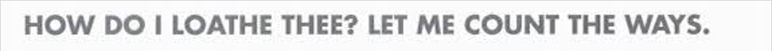

Many people believe that there is nothing fuller of pathos than Shakespeare’s tragedies, and I like to think that they are the same people who have never seen an adaptation of his works set in modern times – in high schools, where the real tragedies happen. I can name a couple of “Shakespeare-approved” masterpieces; however, I believe that we can all agree on which is the superior adaptation – and that is undoubtedly **10 Things I Hate About You**, with a title that is engraved in our midsummer night's dreams.

![10 Things I Hate About You's movie poster [credit: IMDb]](../uploads/dkjfekjc.jpg)

The tagline is one of the first elements our eyes are attracted to.

It is written in capital letters, and uses Archaic English to make it look like a real quote from Shakespeare. The typeface chosen is a variation in small caps of **Niva** (**Niva Black**), a sans serif designed by Pedro Gonzàlez, founder of PeGGO, with the intention of fusing together **technical and aesthetical features** in order to create the perfect font for every use, from magazines to, like in this case, movie posters.

![Niva Black's family [credit: fontke]](../uploads/360x270.png)