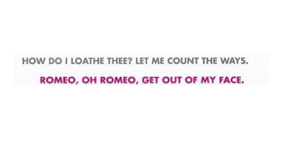
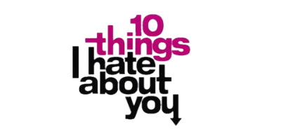
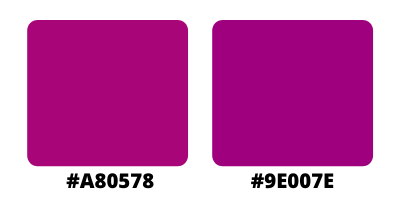

Many people believe that there is nothing fuller of pathos than Shakespeare’s tragedies, and I like to think that they are the same people who have never seen an adaptation of his works set in modern times – in high schools, where the real tragedies happen. I can name a couple of “Shakespeare-approved” masterpieces; however, I believe that we can all agree on which is the superior adaptation – and that is undoubtedly **10 Things I Hate About You**, with a title that is engraved in our midsummer night's dreams.

![10 Things I Hate About You's movie poster [credit: IMDb]](../uploads/dkjfekjc.jpg)

Let's start with the taglines. They both are written in capital letters, and differ in colour and in language, since in the one above **Archaic English** was used to make it look like a real quote from Shakespeare.

It is written in capital letters, and uses Archaic English to make it look like a real quote from Shakespeare. The typeface chosen is a variation in small caps of **Niva** (**Niva Black**), a sans serif designed by Pedro Gonzàlez, founder of PeGGO, with the intention of fusing together **technical and aesthetical features** in order to create the perfect font for every use, from magazines to, like in this case, movie posters.

![Niva Black's family [credit: fontke]](../uploads/360x270.png)

The title, on the other hand, is written in a memorable version of **Helvetica** (or **Neue Haas Grotesk**), a sans serif designed by Max Miedinger and Eduard Hoffman in 1957. Originally Helvetica, as the name suggests, was designed with a neo-grotesque style, with a high x-height and little space between the letters, in order to give the illusion that they were almost brushing against each other thanks to its **bold features**; it soon became so popular that it inspired several other variations.

This variation is called **Helvetica Exp. Black** and features even bolder letters, which make the title appear more impacted and way striking than the original. This effect has mostly one purpose, which is to make it look like a **scribble** from the protagonist’s notebook, where she indeed wrote down the infamous “10 things”. It is clearly noticeable from the **unevenness** of the letters, like the cut-out “i” and “h”, or the “t”’s **prolonged** dash. Along with the **arrow** coming out of the “u” and pointing directly at the poor subject of Kat’s mistaken – and then justified, I must add – hatred, these little scribbling elements are what makes our eyes linger on the movie’s title at first.

The choice of colours is interesting, too. While “I hate you” is symbolically in black, the first two words are in a darker and purplish shade of magenta called **Lipstick** (#A80578), similar to **PANTONE 2415 C** (#9E007E).

This colour is **bold** and **energetic**. Had it been red, it would have given the observers the feeling that the movie was more focused in the romantic tropes; on the other hand, a purplish shade evokes **creativity** and extravagance, mystery and ambition.

Therefore, the scribbled title certainly does not fall through the net, and instead reflects perfectly the **protagonist’s personality**.