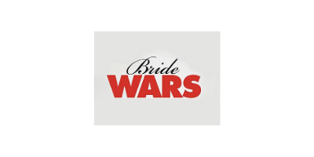

There is just one thing that can come between two people who have grew up together, whose bond is as long lasting as the old Nintendo DS that lays forgotten in one of your desk's drawers – and that is a wedding in June at *the* Plaza. Pretty specific, don't you think? Except for the fact that it really did happen, in fiction of course, to the two protagonists of one of the most famous romantic comedies about weddings: **Bride Wars**.

![This movie's poster [credit: IMDb]](../uploads/mv5bmtuyntg2otuwn15bml5banbnxkftztgwnzezmzg5mti-._v1_uy1200_cr90-0-630-1200_al_.jpg)

In Bride Wars, Kate Hudson and Anna Hathaway play the roles of the two best friends Emma and Liv. Since they are both famous actresses, their names are written twice on the poster: one above, and one below in the movie's credits.

The names are written in Geographica Script, a variation of Brian Wilson's typeface, which was inspired by the handwriting of Thomas Jefferys, King George III's geographer. This font is purely ornamental, with its elegant swirls and curving letters, and is therefore widely used on the labels of luxury goods.

![[credit: Oldfonts.com]](../uploads/script.png)

On the other hand, the actresses' surnames are written in Futura PT Light, a variation of the typeface designed by Paul Renner in 1927 for Bauer company. It is a sans-serif with geometrical shapes, which perfectly presents the style of its period, with its classic and condensed letters.

![[credit: Wikipedia]](../uploads/futura.png)

There is a reason why the poster juxtaposes Geographica Script and Futura PT; in fact, it recreates the effect of a wedding invitation, where the font used for the names of the bride and the broom usually emulates handwriting, whereas the rest of the text always has a simple yet elegant style – and is usually in cap-locks, too.

The poster’s tagline is positioned exactly between the two characters, in a way to attract the observer’s eyes. The typeface used for it is Regular Arial, a sans-serif designed in 1982 by Robin Nicholas and Patricia Saunders for Monotype Typography.

Regarding the movie’s title, the effect is the same as the actresses’ credits: the word “bride” is written in an elegant and undefined mixture of fonts, costumed in order to emulate handwriting; the word “wars”, on the other end, is written in an extra black variation of Futura.

"War" (coordinated with the actresses’ surnames) is also red (#B43232), a colour known for representing strong, extreme and contrasting feelings. It can symbolise danger, assertion and survival. The choice of colour of this word is deeply influenced by the plot.

In fact, although the protagonists have completely opposite personalities, they grew up together and share the same dream of getting married in June at the Plaza. However, due to an error made by the wedding planner, they accidentally book their weddings for the same day – and despite they both want the other's presence that day, neither of them is willing to give in, so the two brides end up fighting and are willing to do anything in order to sabotage each other’s wedding, from sneaking into the hairdresser's storage in order to switch the hair dye from platinum to blue, to public humiliation.