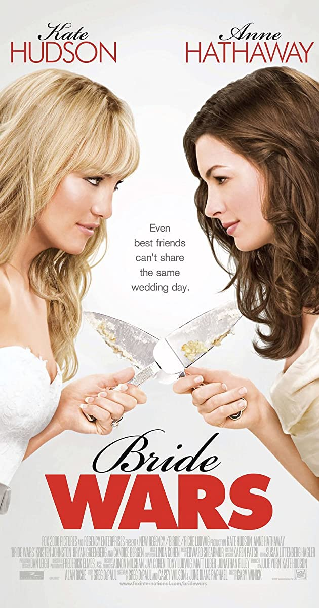
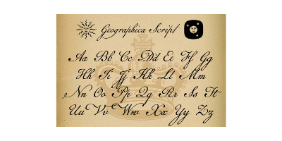
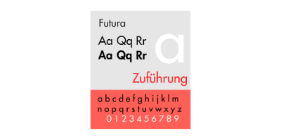
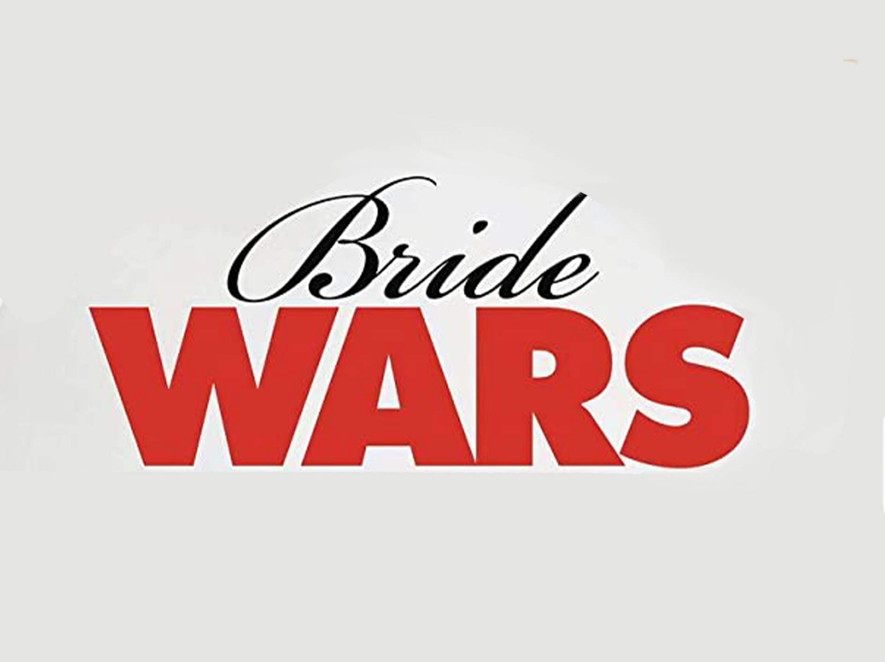
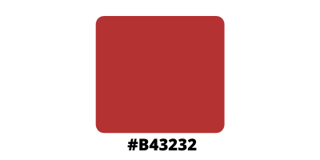

There is just one thing that can come between two people who have grown up together, whose bond is as long lasting as the old Nintendo DS that lays forgotten in one of your desk's drawers – and that is a wedding in June at *the* Plaza. Pretty specific, don't you think? Except for the fact that it really did happen, in fiction of course, to the two protagonists of one of the most famous romantic comedies about weddings: **Bride Wars**.

In Bride Wars, Kate Hudson and Anna Hathaway play the roles of the two best friends Emma and Liv. Since they are both famous actresses, their names are written twice on the poster: one above, and one in the movie’s credits below.

The names are written in Geographica Script, a variation of Brian Wilson’s font, which was inspired by the handwriting of Thomas Jefferys, King George III’s geographer. This font is purely ornamental, with its elegant swirls and letters, and is therefore widely used on the labels of luxury goods.

The actresses’ surnames, on the other hand, are written in Futura PT Light, a variation of the typeface designed by Paul Renner in 1927 for Bauer company. It is a geometric sans-serif, and it perfectly represents the style of its period, with its classic and condensed letters.

There is a reason why the poster juxtaposes Geographica Script and Futura PT; in fact, it recreates the effect of a wedding invitation, where font used for the names of the broom and the bride emulates handwriting, whereas the rest of the text has a simple yet elegant style – and is usually in cap-locks, too.

The poster’s tagline is positioned exactly between the two characters, in a way to attract the observer’s eyes. The typeface used for it is Regular Arial, a sans-serif designed in 1982 by Robin Nicholas and Patricia Saunders for Monotype Typography.

Regarding the movie’s title, the effect is the same as the actresses’ credits: the word “bride” is written in an elegant and undefined mixture of fonts, costumed in order to emulate handwriting; the word “wars”, on the other end, is written in an extra black variation of Futura.

The choice of colour of the title is deeply influenced by the plot. Although the protagonists have completely opposite personalities, they grew up together and share the same dream: getting married in June at the Plaza. However, due to an error made by the wedding planner, they accidentally book their weddings for the same day, thus they end up fighting because they are each other’s maid of honour – and neither of them is willing to give in.

Therefore, the word “wars” (coordinated with the actresses’ surnames) is in moderate red (#B43232), a colour known for representing strong, extreme, and contrasting feelings. It can symbolise danger, assertion and survival, which are more or less important elements of the story, since the two brides are willing to do anything in order to sabotage each other’s wedding, from dying hair from platinum blonde to blue, to public humiliation.