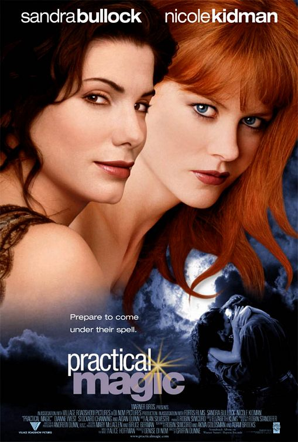
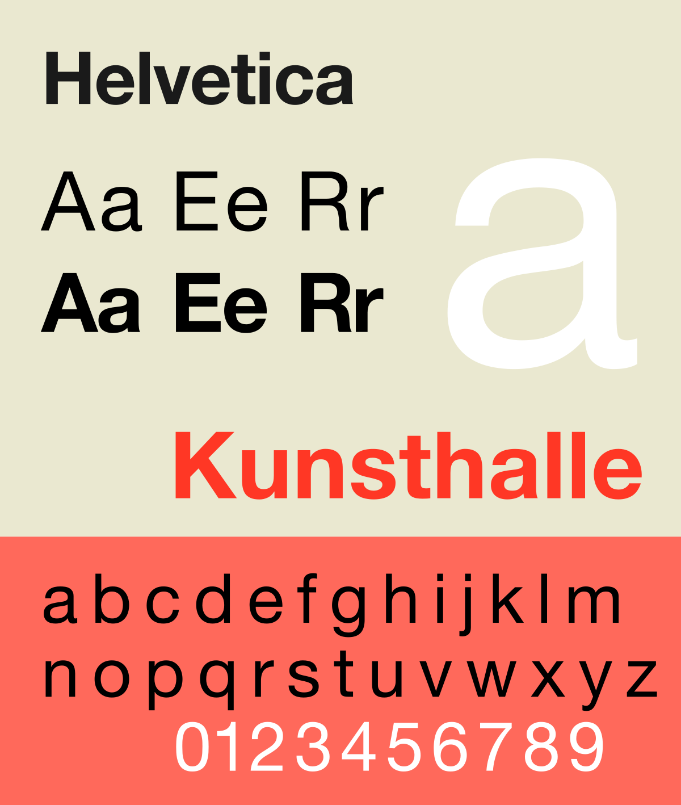
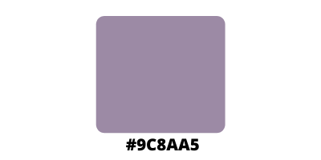

What if some women were made differently? What if the ingredients weren’t sugar, spice, and everything nice – but blackthorn, fairy dust, and salamander eyes? They would be witches, of course, women capable of turning you into a frog with just one look. They inhabit popular culture just as much as any other magical creatures, if not even more, but what happens when they are mixed with relatability? The answer is simple: Practical magic.

This is a cult movie, one of the most popular Fantasy rom-coms of the last twenty years. It features the talented Sandra Bullock and Nicole Kidman in the roles of two sisters belonging to an old and established family of witches, whose members are cursed: in fact, every lover they have is destined to perish, in order to protect them from getting their hearts broken.

In Practical magic, the absolute protagonist is magic: you can see it in the plot, in the scenarios – and in the movie’s poster, through the use of imagery, typography, and colours. The title itself is a clear example.

Invented in 1957 by the typeface-designers Max Miedinger and Eduard Hoffman, Helvetica (or Neue Haas) is a neo-grotesque sans-serif, widely used for commercial wordmarks. It has become so popular that there are several variations of it, and we can see two of them in Practical Magic’s title.

The first word (“Practical”) features a condensation of the letters, making them appear neat and determined, just like Sandra Bullock’s character. “Magic”, on the other hand, is a bold Helvetica Grotesk, a recent variation designed by the American designer Christian Schwartz, who made it much more versatile and impactful; this way, the word stands out even more.

Another important element of the title is the little spark used as a superscript dot on the “i” of “magic”, which gives the impression of a spell casted by the title itself. This intention is hidden behind the choice colouring such word with a shade called amethyst smoke (#9C8AA5).

Purple has always been associated with creativity and wisdom, independence and witchcraft, so it’s not a surprise that it is also used for this movie’s title, as it is an eccentric colour that perfectly represents two eccentric and magical sisters. However, it also the colour of the amethyst, a gem known for its protective nature, used by wiccans in order to guard themselves from both physical and spiritual assaults, a reference to the real antagonist of this movie, the curse that keeps killing the lovers of the protagonists’ family.