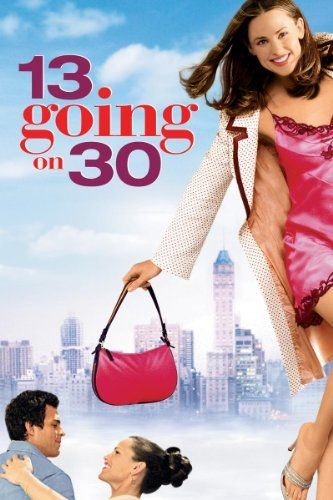
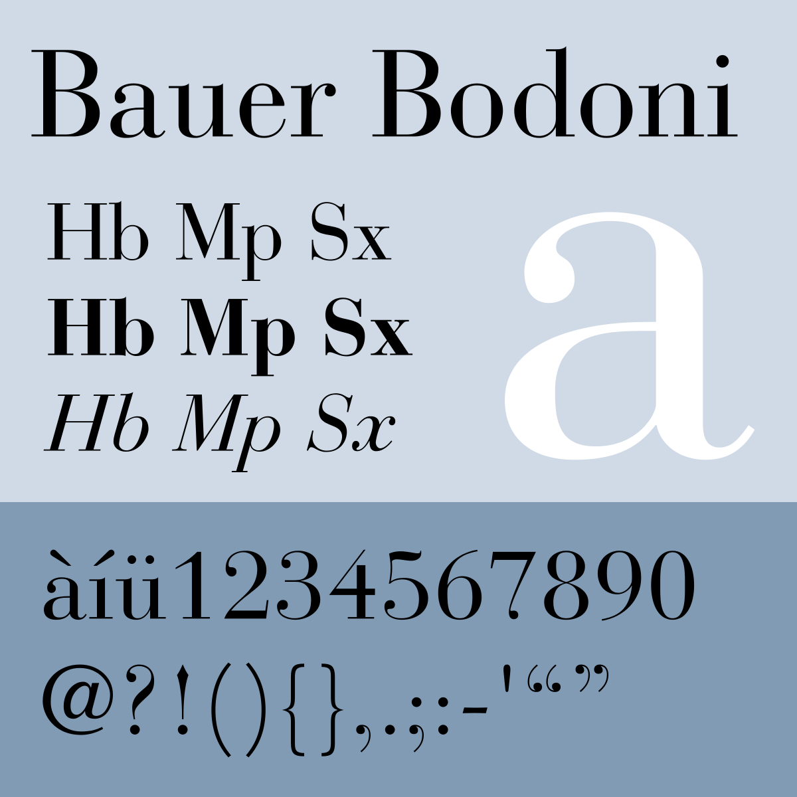
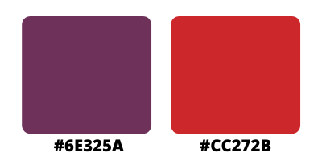

Like most people, when I was a teenager, I wished that time passed in the blink of an eye, because I thought that adulthood would have solved all my problems. Thankfully, the universe taught me a life lesson like it always does: through a movie. In this case, it was **13 going on 30**, a movie that will always have a place in my heart. I’ll explain why via its title’s analysis.

As always, let’s start with the font’s ID. Designed by Heinrich Jost in 1926, **Bauer Bodoni** is a revisitation of the typeface created by the Italian typographer and type-designer Giambattista Bodoni during the 18th century. The latter, along with Firmin Didot, was the father of the «**Modern**» style as we know it.

This typeface is a **serif** of high impact that focuses on the strong and **vivid contrast** between strokes and hairline. As aesthetically pleasing as they are, the beautiful curves of these letters end up creating an effect that negatively affects their legibility.

As you can see, the two numbers “**13**” and “**30**” belong instead to a different typeface (**Craft Gothic**), a sans-serif, its simplicity creating a nice, **smooth contrast** as it is placed side by side with the bold and elegant Bodoni. Not only do they differ in font, but also in colour.

The first one is a **light** **purple**, similar to the popular shade “palatine”, which is widely used by universities such as Durham for their official colours. It looks royal and elegant, and is associated with **wisdom**, **independence**, and magic. The second colour, on the other hand, is a **vivid red** (similar to the shade “cardinal”), which is **emotionally intense**, determined, and extreme.

By succeeding these opposite **colours**, along with two typefaces that seem to have nothing in common, the title reflects through its **composition** what the plot is communicating: the protagonist wants to become independent and forget about all her adolescence’s drama, she is ready to leave everything behind and jump into adulthood unprepared. Thus, when her wishes, which are driven by her desire for an **extreme and dramatic change**, are granted by the universe, she embraces the gift and tries to make the most out of it. These extreme feelings are symbolised by the **red** in the middle.

The purple, however, is the **evolution** of her character throughout the story. She is a thirteen years old girl in the body of a thirty years old woman; she does not fully understand most of what surrenders her, she is too young and naïve – and she ends up extremely disappointed as she realises the horrible person she will become in the future if she stays in the same pathway. Nevertheless, she shows a great maturity for such a young girl, going through an admirable **self-growth journey** while she tries to make it up to the people her older-self hurt.

At the end of the story, Jenna is still thirteen years old, that is true, but she has also become more mature and wiser, and this change is represented by the **purple**.