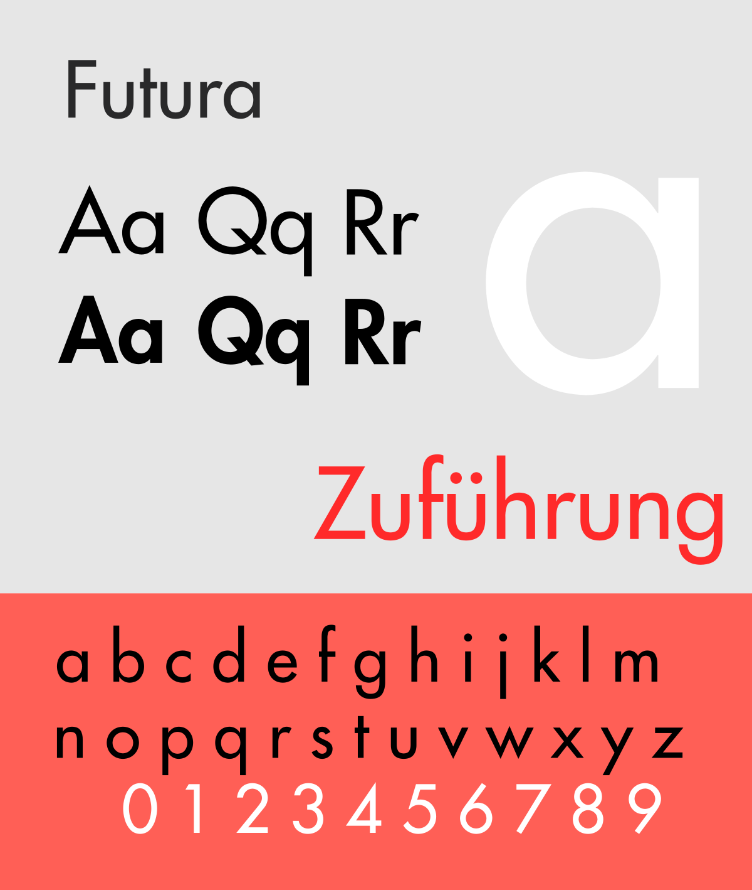

It is widely known that Hollywood lacks diversity. The majority of stories, with little exceptions, revolve around white characters, and tend to utilise BAME actors and actresses in their tokenism; this being said, if they cast them in the first place. However, as modern times are changing for the better our society, such changes are destined to impact every single angle, Hollywood included – one movie at a time. In today’s article, I’m analysing one of the new gems of this long-waited improvement in representation: Crazy Rich Asians.

I adore this poster: it's so colourful and powerful, and it perfectly summarises the plot and the themes behind it. The title in particular is a mirror, and I'm going to explain why. But first, let's start with the font.

You might recognise it from one of my previous articles, "I now declare you title and font", which was about Bride Wars. It is indeed **Futura**, and it is used in two variations: one is medium, and the other one is light.

The original typeface was designed by Paul Renner in 1927 for Bauer Company. It is a sans-serif, and it is geometrical, essential, almost simplistic. However, when used in the Light variation, the letters become thinner and slimmer, and appear beautifully elegant and rich.

In the intensification of this effect to the observer's eyes, there are two elements that play a huge role: on one hand, there is the thin frame of gold around it, that reminds of luxurious invitations; on the other hand, there is the size used for the word "rich", which is bigger than the one used for the other two words, and is therefore attracting all the attention.

The colour shares their purpose in a more explicit way. Had it been a richer gold, it would have appeared tack-ish and pretentious to any observer; however, it is a really pale shade of **gold** (#ECCC75), similar to sand, with a nice **holographic** effect on the letters.

Thanks to the choice of colour, the title reminds of a gold ingot shining, and fulfils its ambition to present a product that was made to amaze the eyes, to give the feeling of having in front of them something rich, expensive, that is given exactly to them by watching the movie. However, the effect is fake, just like the rich people depicted in the movies, who are too blinded by the gold to realise that it has corrupted them and has destroyed their moral compass.