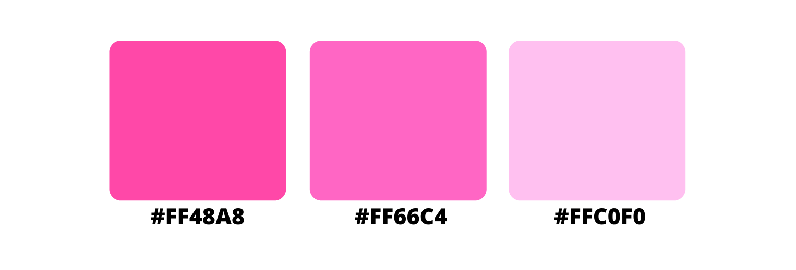

Hello!

My name is Marty, and I am a Media, Journalism and Publishing student at Oxford Brookes University. “**Pretty in Font**” was born as a project for my **Typographic** module, uniting two of my biggest passions: writing, and watching romantic comedies.

In this blog, I analyse some of my favourite movies’ titles, in order to give you as much information as I can about their **fonts**: the history behind them, the colours used, the resulting composition, and so on.

You’ll notice that most of these movies utilise classic fonts, simple imagery, and many shades of pink; therefore, as pink is protagonist colour of rom-coms, it is also made the protagonist of this blog. I didn’t just choose it because it is the colour that women and girls are always associated with; instead, I chose it because it is **vibrant** and **elegant** and harmonious yet strong and decisive, and it perfectly describes the **empowering** and life-changing journeys of the women narrated in the movies whose titles I’m analysing.

I love pink, thus deciding which shades to use for the logo and the favicon was definitely my favourite part of this whole project. Although I use some other colours and shades for contrast in some banners from time to time, depending on what I feel would suit better the movie in question, I do have some predefined shades:

I chose **Alegreya** for both the headings and the body text for the same exact reason. Designed by Juan Pablo del Peral for Huerta Tipográfica, this typeface is relatively **recent** yet seems classic enough to pass as a coetaneous of Times New Roman or Palatino Linotype, being used mostly in literature.

![Alegreya Family Font [credit: 1001 fonts]](../uploads/alegreya-font-5-big.png)

In this case, it is a serif (of course), but its family is composed of several versions that go from sans serif to small-caps – and even black 100. Therefore, with its elegant appearance due to the **hefty serifs** and the **dynamic curves** of the letters that seem to carry with themselves a global appreciation, Alegreya is perfect for the **graceful aesthetic** of this blog.

The same graceful effect is given by the banners filled with **peonies**; considered by many cultures the most beautiful flower, it symbolises beauty, romance and prosperity, and also love at first sight when its petals are light pink. They appear even prettier thanks to the **filters** applied on them, which not only make the images' colours cooler and distant, but also make them resemble a **painting**.

For the **logo**, I chose something that many of us buy before entering the cinema's room, and that most of the times does not last till the end of the advertising. Many like them salty, some like them sweet; but either way, popcorns are a classic and popular element of the **cinematic culture**, one of the elements that we associate with movies in the same way as pink comes to our mind whenever we think about romantic comedies.

The other reason why I decided to use popcorns is personal. One time, at the age of 9, I went to the cinema to watch Breaking Dawn part 2. During a certain scene that we all know and gasped at, I was so shocked by what had happened that I choked on a popcorn and almost died on the spot. Kinda dramatic, I know, and I am still ashamed of it, but I guess that what doesnt kill you really makes you stronger – and gives you a good idea for your university's assignment almost a decade later. 

Therefore, I fused together the two elements (my dislike for popcorns + my beloved pink) and transformed popcorns into something closer to my topic, using shades of pink for the box, with a light pink "p" (#FFC0F0) rigorously in **Alegreya**. The **black lines** around it are used for contrast, to make it stand out next to the blog's title, and are a bit irregular to resemble the effect of someone's drawing.

In the same way, my **favicon** is a camera, another popular and classic symbol of the cinematic culture; it is white on pink (#FF48A8), the same **effect** used for many rom coms' titles – a transition from white to pink, in order to symbolise the act of **self-consciousness** of the movies' protagonists, from naivety (white) to full confidence (hot pink).

With Pretty in Font, my hopes are to share my love for rom-coms and eliminate the stigma attached to them being “chick movies”, so that my readers can discover a new passion and appreciate them at least a small amount of how much I love them. In order to do so, I have decided to analyse their titles, since they are just like **business card**: they are vital for understanding the people (or the movie, in this case) behind them, and they summarise their **values** in a symbolic and implicit way, through the choices of fonts and imagery and colours.

**Two small notes:** 

1. The pictures and the illustrations used in this blog, unless otherwise credited, are implicitly and originally downloaded from Canva; however, I have modified them and created new images which are 100% the fruits of my creativity - plus the countless amount of hours spent working on them on different softwares;

2. The information I give in each article mostly come from either my knowledge/mind or this lovely [page](https://www.corbencolourtheory.com/meanings-and-interpretations.html) – or Wikipedia itself. Moreover, I used both [Font squirrel](https://www.fontsquirrel.com/matcherator) and [What the font ](https://www.myfonts.com/WhatTheFont)in order to find out which fonts were used in the movie posters.